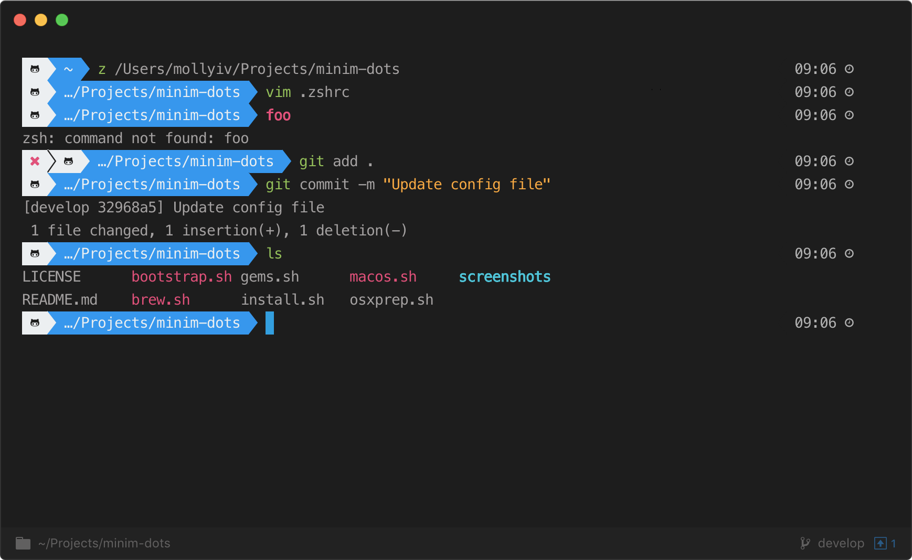

# minim-dots
macOS development environment setup dedicated mostly to iOS developers. 

# Introduction
The goal of `minim-dots` is to simplify development setup on new machine which can be very time consumption and manual process. I was trying to keep overall minimalist setup - mostly for iOS developer. 

You are more than welcome to fork this repository and adjust the apps, tools and settings to your needs. 

Feel free to give your feedback, let's make this project better together!

# Usage
```
$ ./.install bootstrap osxprep brew macos gems
```

# Scripts

* install.sh
    * Runs specified scripts
* bootstrap.sh
    * Syncs dot files and scripts to your local home directory `~`
* osxprep.sh
    * Updates OS X and installs Xcode command line tools
* brew.sh
    * Installs Homebrew and apps
* osx.sh
    * Sets up OS X defaults 
* gems.sh
    * Installs gems


# Tools and Applications 
* Homebrew
* Homebrew Cask
* Python
* Ruby and rbenv
* Docker
* Carthage
* Swiftlint
* Mitmproxy
* Cocoapods
* Bundler
* Fastlane
* Hyper
* Firefox
* Brave
* Java
* Slack
* Visual Studio Code
* Sourcetree
* Tidal
* Spotify
* Bear


# Hyper



1. Install [oh-my-zsh](https://github.com/robbyrussell/oh-my-zsh)
2. Install [powerlevel9k](https://github.com/bhilburn/powerlevel9k)
3. Install [nerd-fonts](https://github.com/ryanoasis/nerd-fonts)
4. Install [zsh-syntax-highlighting](https://github.com/zsh-users/zsh-syntax-highlighting)
5. Install [zsh-autosuggestions](https://github.com/zsh-users/zsh-autosuggestions)
6. Install [z](https://github.com/rupa/z) tool to quickly jump between projects


# Visual Studio Code

1. Modify user's settings

``` User Settings.json
{
    "terminal.integrated.shell.osx": "/bin/zsh",
    "terminal.integrated.fontFamily": "MesloLGL Nerd Font Mono",
    "terminal.integrated.rendererType": "dom",
    "editor.minimap.enabled": false,
    "editor.fontLigatures": true,
    "editor.fontWeight": "500",
    "workbench.colorTheme": "Andromeda Colorizer",
    "workbench.iconTheme": "material-icon-theme",
    "workbench.colorCustomizations": {
        "editor.background": "#1e1e1e",
        "titleBar.activeBackground": "#1e1e1e",
        "editorGroup.dropBackground": "#1e1e1e",
        "editorGroupHeader.tabsBackground": "#1e1e1e",
        "tab.border": "#1e1e1e",
        "tab.inactiveBackground": "#1e1e1e",
        "sideBar.background": "#1e1e1e",
        "activityBar.background": "#1e1e1e",
        "editor.foreground": "#ffffff",

        "statusBar.background": "#1e1e1e",
        "statusBar.debuggingBackground": "#FC644D",
        "statusBar.noFolderBackground": "#1e1e1e",
        "statusBarItem.activeBackground": "#00e8c5cc",
        "statusBarItem.hoverBackground": "#07d4b5b0",
        "statusBarItem.prominentBackground": "#07d4b5b0",
        "statusBarItem.prominentHoverBackground": "#00e8c5cc",
    },
    "window.zoomLevel": 1,
}
```

2. `code` alias support

If you hit `$ code: command not found`, launch VS Code, open the Command Palette (⇧⌘P) and type shell command to find the Shell Command: Install 'code' command in PATH command.


# Credits 
This repository builds on amazing work from:
* [Mathias Bynens](https://github.com/mathiasbynens/dotfiles)
* [Donne Martin](https://github.com/donnemartin/dev-setup)
* [Felix Krause](https://github.com/KrauseFx/what-terminal-is-felix-using)
* [Carl Vuorinen](https://github.com/cvuorinen/dotfiles)
* [Maciek Grzybowski](https://github.com/ncreated/dotfiles)

Thank you so much for your effort guys :pray:


# License
The MIT License (MIT)
